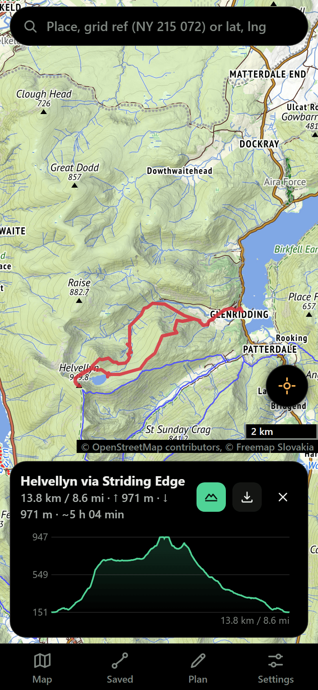
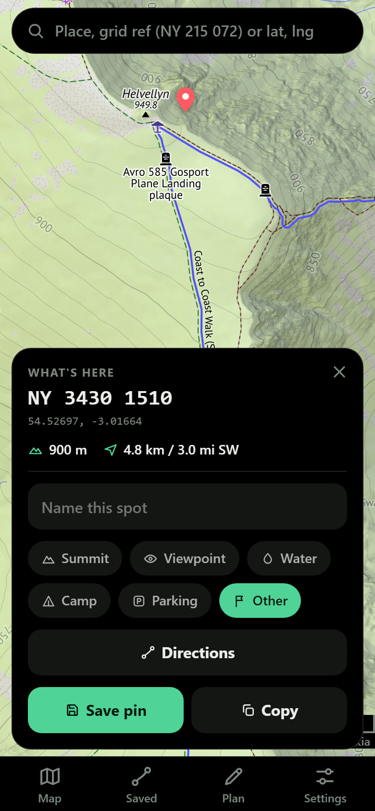

# Trailhead

**Live: https://yuzhoutian.github.io/trailhead/**

A personal, bloat-free hiking map PWA. No accounts, no paywalls, no tracking — just maps,
routes that follow real paths, and a dot showing where you are.

<p align="center">
  
  &nbsp;&nbsp;
  
</p>

Everything lives on your phone: routes, pins and settings are in `localStorage`, so there is
nothing to sign into and nothing to sync. The whole app is a static site — the only servers
involved are free, keyless, public ones (map tiles, routing, search), called directly from
the browser.

## The app in one screen

A full-screen map with a search box on top, a floating locate button, and four tabs along
the bottom. Three of the tabs open a **bottom sheet** — a panel that slides up from the tab
you tapped, scrolls inside itself, and leaves a sliver of map showing above it. Close it by
tapping the same tab again, the close button, the dimmed map behind it, or by flicking the
handle at its top edge downwards.

| Tab | What's in it |
| --- | --- |
| **Map** | Sheet: base layer, the map key, the overlay + opacity slider, and "What's nearby" |
| **Saved** | Sheet: your routes and pins; import GPX, scan a route QR, paste a shared link |
| **Plan** | No sheet — it turns the map into the route planner (tap points to draw a line) |
| **Settings** | Sheet: appearance, Thunderforest key, routing profile, walking speed, nearby categories, offline map usage, build version |

When a route is loaded, a card floats just above the tabs with its name, stats, what's left
of it, and buttons to open the elevation profile or cache its tiles. A long-press anywhere
on the map opens a similar card for that spot.

## Features

### Planning a route

- **Tap-to-plan** — tap points on the map and the line snaps to real paths and trails via the
  free [BRouter](https://brouter.de) public server. Waypoints are draggable; Undo and Clear
  are in the plan bar. Distance, climb and a time estimate update as you go. **Done** offers
  to name and save the route; cancelling still leaves it loaded, just unsaved.
- **Routing profiles** (Settings) — *General hiking* (default; footpaths and easier trails),
  *Mountain hiking* (happy with steep, rough, exposed paths), *Trekking* (BRouter's bike-touring
  profile — the useful fallback when the hiking profiles refuse to connect two points), and
  *Shortest*.
- **Per-leg snap toggle** — the magnet in the plan bar turns snapping off, so the next legs
  are drawn as straight lines. That's how you get through a gate, a stile or a field crossing
  that BRouter won't route through. Snapped and freeform legs mix freely in one route.
- **Naismith time estimates** — your flat-ground pace plus an hour per 600 m of climb. Set
  your speed in Settings (default 4 km/h) and every estimate in the app follows it.
- **GPX import/export** — import a track from any other app (Saved → Import GPX file); export
  any saved route with the GPX button on its row.
- Routing needs signal. If the router is unreachable the plan falls back to a dashed
  straight-line route rather than failing.

### Following a route

- **Live position** — the map is on you from the first fix, and there is no off. Tapping
  **Me** while it sits on your dot toggles north-up against **heading-up** (the map rotates
  with your compass); tapping it anywhere else brings you back. Dragging the map — or
  opening a pin, a search hit or a route — pauses the re-centring but keeps the rotation,
  so you can look up the valley with up still meaning forward. The next tap comes back
  heading-up; the one after that squares the map to north.
- **On/off-route banner** — how far you are from the planned line, turning red past 50 m.
- **Route progress** — distance to go, remaining climb and descent, a time estimate at your
  pace, and % done, live on the route card. Progress is projected onto the line in a way that
  survives loops and out-and-backs, where the nearest point of the route is ambiguous.
- **Survives a reload** — the route you are following is remembered, so closing the app (or
  iOS discarding it in your pocket) doesn't lose your walk.

### Elevation

- **Profile chart** — the chart button on the route card draws distance vs height, with a
  scrubber: drag along the profile and a marker moves along the route on the map, so you can
  see which climb is which.
- **Ascent and descent** — both, everywhere: on the card, in the saved list, and in what's
  left ahead of you.
- Route elevation comes from BRouter and from GPX files; single-point heights (pins) come
  from [Open-Meteo](https://open-meteo.com)'s keyless elevation API.

### Knowing where you are

- **Grid reference popups** — long-press anywhere (or tap your own GPS dot) for an OS grid
  reference, decimal lat/lng, ground height and accuracy. This is the mountain-rescue case:
  something to read out over the phone when you need to say exactly where you are. Grid refs
  are computed on-device (`src/osgb.ts`, WGS84 → OSGB36 via a Helmert transform), so they
  work with no signal.
- **Search** — place names, plus OS grid references (`NY 215 072`) and lat/lng pairs
  (`54.4542, -3.2116`) parsed offline. Place-name search is [Photon](https://photon.komoot.io)
  (keyless, OpenStreetMap data), re-ranked for hiking: summits, reserves and lakes first,
  then how exactly the name matches, then how well known the place is — and only then how
  near it is. So Helvellyn the mountain beats Helvellyn Avenue, Sunderland, and Coombe Hill
  the Chilterns summit beats the four Coombe Hill Roads that happen to be closer. Rows read
  "Summit · 260 m · Buckinghamshire · 52 km away": what it is, how high, where, how far.
- **Saved pins** — drop a pin, name it, tag it (summit / viewpoint / water / camp / parking /
  other) and it's kept with its grid ref and height. Any pin can be copied as text or shared
  as a link. Cards show distance and compass bearing from you.
- **What's nearby** (Map tab) — hiking points around the visible map, from OpenStreetMap via
  Overpass. Fifteen categories to choose from — summits, trig points, viewpoints, water,
  waterfalls, shelters and bothies, campsites, pubs and cafés, toilets, parking, public
  transport, picnic sites, cairns and landmarks, caves, emergency points — ticked in Settings
  and defaulting to summits, viewpoints and water. Only the ticked ones are queried, and each
  gets its own result quota so a moor full of tors cannot crowd out every spring.

### Maps

- **Base layers** — *Outdoor* from Freemap (the default: contours, hillshading and crag
  ticks, sharp all the way to zoom 20, Europe only), *OpenStreetMap* (no key, global, and the
  only layer that draws individual gates and stiles) and *Outdoors* from Thunderforest
  (hiking cartography, trails graded by difficulty — needs a
  [free key](#outdoors-layer-optional)).
- **Overlay** — either layer can be drawn over the other with an opacity slider.
- **Map key** — a per-layer legend grouped by the question you're actually asking: can I walk
  it, can I get through, what's the ground like, where's the water. It also says what each
  layer *cannot* show, which matters as much.
- **Dark mode** — light, dark, or follow the phone. Dark themes the app only: the map keeps
  full brightness, because the phone is often in dark mode in broad daylight.
- Distances are shown in **km and miles** together, heights in metres, and there's a metric
  scale bar on the map.

### Sharing and offline

- **Route sharing** — every saved route makes a link and a QR code. Planned routes travel as
  their waypoints (a few hundred bytes; the receiver re-routes them), imported tracks as a
  simplified track. Opening the link saves and loads the route.
- **In-app QR scanning** — Saved → Scan route QR uses the camera to read a route QR straight
  off another screen. On iPhone, a QR scanned with the *system* camera opens in Safari, whose
  storage is separate from the home-screen app — so the app spots that case and walks you
  through the clipboard hand-off (Copy link → open Trailhead → Paste shared route).
- **Offline maps** — every tile you look at is cached by the service worker, and the ⤓ button
  on the route card pre-downloads a tile corridor along the active route (zooms 12–16, capped
  at 4000 tiles) before you leave the house. The app shell itself is cached too, so it starts
  with no connection at all.

## On the trail

The question that actually matters on a hill is what still works with no signal:

| Works offline | Needs signal |
| --- | --- |
| The app itself (cached shell) | Planning or re-routing (BRouter is server-side) |
| Map tiles you've viewed or pre-cached | Tiles you never looked at |
| GPS position, on/off-route banner, progress | Place-name search |
| Grid references, lat/lng, the search box for both | "What's nearby" (Overpass) |
| Saved routes, pins and settings | Ground height for a new pin (Open-Meteo) |
| Elevation profile of a loaded route | |
| Sharing links and QR codes (built on-device) | |

So the routine is:

1. **At home:** plan or load the route, then tap ⤓ on the route card to cache tiles along it.
2. **Outside:** open the app, tap the locate button. Position, cached map, banner, progress
   and grid refs all work in a dead spot. Long-press anything to get a grid reference.

## Install it on your phone

Open the live URL in Safari (or Chrome) → Share → **Add to Home Screen**. It launches
full-screen like a native app, and that installed copy is the one that caches tiles.

## Outdoors layer (optional)

The **Outdoors** base map (Thunderforest) needs a free key:

1. Sign up for a free "Hobby Project" plan at https://www.thunderforest.com — 150,000 tiles a
   month, far more than one walker uses.
2. Paste the key into **Settings → Thunderforest API key**, then pick Outdoors in the Map tab.

OpenStreetMap needs no key, and place-name search (Photon), routing (BRouter), elevation
(Open-Meteo) and nearby points (Overpass) are all keyless too — so the app is fully usable
with nothing configured at all.

## Design

The look is meant to be a field instrument rather than a web page: read one-handed, on a
slope, often in sunlight and often with the phone in dark mode in the middle of the day.
Everything visual is decided in one file, `src/style.css`, at the top:

- **Tokens.** Every colour, radius and text style is a named value in the `:root` blocks.
  Nothing further down the file writes a colour of its own. Dark mode is those same names
  given different values — one block, not a second stylesheet. The two deliberate exceptions
  are map symbology (a marker has to look the same over any tiles, in either theme) and the
  QR screens (a code has to be black on white to scan, whatever the app looks like).
- **Six text styles.** Caption, eyebrow, body, UI, title, display — plus a monospace one for
  the grid reference. Every piece of text picks one of them; nothing invents its own size.
  Which rung a thing sits on is decided by "do I read this while walking?", which is why the
  distance-to-go outranks anything in Settings. Anything numeric gets tabular figures so the
  digits do not jitter as a GPS fix updates.
- **Four corner radii.** 10 for fields and small buttons, 14 for buttons and list cells, 20
  for floating cards and sheets, and a full pill for the search bar, chips and the toast.
- **Dark is true black.** On an OLED phone a black pixel costs no power, so the chrome is
  `#000000` and the map underneath is the only bright thing on screen. The map itself is
  **never dimmed** — dark mode follows the phone, the phone is often dark in daylight, and a
  dimmed map in sunlight is exactly the wrong trade on a hill.
- **One icon grammar.** Every glyph is drawn on a 24×24 grid with a 2px stroke, round caps
  and joins, no fill, and a little clear space so nothing touches the edge of its box. They
  live as a sprite in `index.html` and inherit the current text colour, so one drawing serves
  both themes and every state. A selected tab fills its outline with a faint wash of its own
  colour rather than swapping in a second icon.
- **44px.** Nothing you tap is smaller than 44px in either direction, with three deliberate
  exceptions: the pin card's category chips and the route card's header buttons are 36px, and
  close buttons are 40px.

`scripts/contrast-audit.mjs` reads the tokens straight out of the stylesheet and checks every
text-on-background pair in both themes against the WCAG AA floors (4.5:1 for text, 3:1 for
icons). Run it with `node scripts/contrast-audit.mjs src/style.css` after changing a colour.

The full specification, including what was considered and rejected, is in
[`docs/redesign-plan.md`](docs/redesign-plan.md).

## Develop

```
npm install
npm run dev     # vite dev server on http://localhost:5173
npm run build   # production build into dist/
npm run preview # serve the built app (service worker only runs here, not in dev)
npm test        # unit tests, once
npm run test:watch
```

On Windows, `Start Trailhead.cmd` does the dev-server dance and opens a browser for you.

### Tests

Vitest, in the node environment, with each test file sitting next to the module it covers
(`src/geo.test.ts` beside `src/geo.ts`). They cover the pure logic only — the maths and the
parsing, where a silently wrong answer is most expensive. The feature modules touch the DOM
and Leaflet and are not covered yet.

Fixtures come from published sources rather than from the code's own output, so the tests say
something about correctness rather than merely detecting change. In particular `osgb.ts` is
checked against all forty of Ordnance Survey's own OSTN15 transformation test points, from the
Scillies to Shetland; it agrees with them to under five metres, which is the expected error of
a Helmert transform standing in for the full OSTN15 grid.

Two tests are marked `it.fails`. Those are known bugs with the assertion already written
([#41](https://github.com/YuzhouTian/trailhead/issues/41),
[#42](https://github.com/YuzhouTian/trailhead/issues/42)); fixing the code turns them green,
and the marker comes off in the same commit.

`npm test` runs in CI ahead of the build, so a failing test blocks the deploy.

### Project layout

| File | What lives there |
| --- | --- |
| `src/main.ts` | The wiring: starts everything up and connects the pieces below to each other |
| `src/map/` | The Leaflet map itself: tile layers, the overlay, the viewport quirks |
| `src/features/` | One file per thing the app does: tracking, planner, pins, search, offline, sharing, QR |
| `src/ui/` | The screen furniture: the bottom sheet and its panels, the route card, shared helpers |
| `src/config.ts` | Base layers, BRouter profiles, and the tuning constants (off-route thresholds, offline zooms and caps) |
| `src/state.ts` | The `localStorage` layer: settings, saved routes, pins, active route |
| `src/geo.ts` | Distance, bearings, route projection/progress, Naismith, ascent/descent, simplification, tile maths |
| `src/routing.ts` | BRouter calls, including mixed snapped/freeform legs |
| `src/osgb.ts` | OS National Grid references both ways, on-device |
| `src/search.ts` | Search box resolution: grid ref, lat/lng, then Photon place names with hiking-first ranking |
| `src/poi.ts` | "What's nearby" — the category table and what each one asks Overpass for |
| `src/overpass.ts` | Talking to the Overpass mirrors: staggered requests, first answer wins |
| `src/elevation.ts` | Point elevation lookup, and the SVG profile chart with its scrubber |
| `src/legend.ts` | The map key: per-layer legends, drawn as inline SVG swatches |
| `src/share.ts` | Share links: compact payloads in the URL fragment, encode and parse |
| `src/polyline.ts` | Encoded-polyline codec used by the share payloads |
| `src/gpx.ts` | GPX parsing and writing |
| `src/style.css` | All the styling, including the light/dark tokens and the type scale |
| `index.html` | The DOM skeleton and the SVG icon sprite |
| `public/sw.js` | Service worker: app-shell cache + tile cache |
| `scripts/` | Developer tools that are not part of the app: the contrast audit and the screenshot script |

## Deploy

Already set up: pushing to `main` triggers `.github/workflows/deploy.yml`, which builds and
publishes to GitHub Pages. Nothing else to do — `git push` is the deploy.

(Pages source is set to "GitHub Actions" in repo Settings → Pages; that's a one-time setting.)

Settings shows the build timestamp, so you can tell at a glance whether a phone is running
the latest deploy or a cached older one.

## Notes / limits

- iOS PWAs only get GPS while the app is open on screen — fine for "where am I?", but this
  app deliberately does not do background track recording.
- The public BRouter server is free and CORS-enabled; be a good citizen (it's one hobbyist
  request at a time, which is exactly what it's for). Offline tile downloads are capped at
  4000 tiles per go to stay within OSM's tile usage policy.
- Overpass ("What's nearby") is a shared free service that regularly rate-limits or times
  out. The app tries several mirrors; if they're all busy, try again in a minute.
- Grid references only exist for Great Britain. Elsewhere, cards and popups show decimal
  lat/lng instead.
- Storage is per-browser. The home-screen app and Safari keep separate copies, which is why
  shared routes need the clipboard hand-off rather than just opening.
